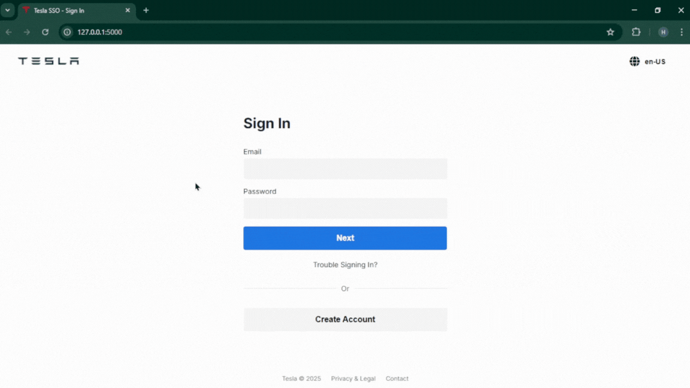

# Tesla-Clone-Phishing-Edu

This is a simple clone of the Tesla login page built using **Python**, **Flask**, **HTML**, and **CSS**. It is intended for **educational purposes only** to learn about backend and frontend integration. This project simulates a phishing page where users enter their email and password, which are then saved to a local file on the developer's system. **It is not intended for deployment**.

### Demo


---

## Disclaimer

**For educational purposes only.**  
This project is not for malicious use. Use it responsibly in controlled, ethical, and legal environments.

---

## Tech Stack

- **Backend**: Python, Flask
- **Frontend**: HTML, CSS
- **Other**: Local file storage for capturing input data

---

## Installation

1. Clone the repository:
   ```bash
   git clone https://github.com/yourusername/Tesla-Clone-Phishing-Edu.git
